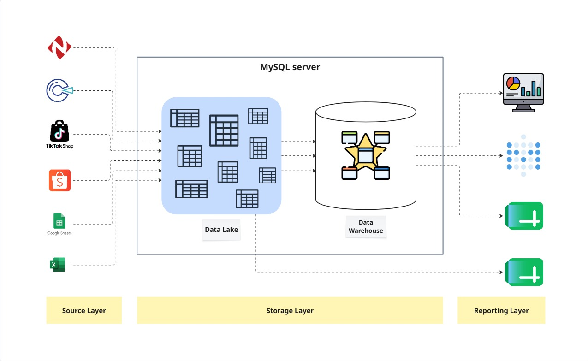
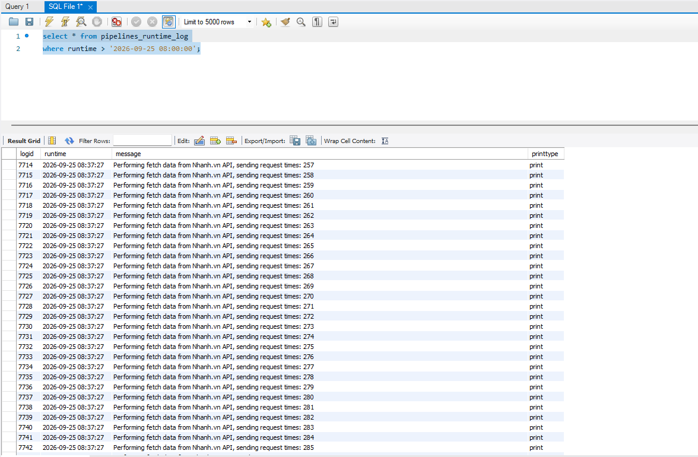
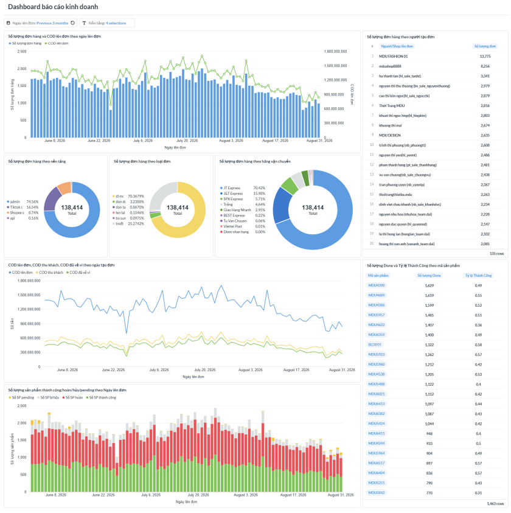

# END-TO-END DATA WAREHOUSE SYSTEM

## 1. Overview

This project builds a complete ***end-to-end Data Warehouse system*** for a medium-sized online fashion company. It automates the collection, transformation, integration, and historical storage of order, delivery, customer, product, and financial data for reporting and analysis.

## 2. Business Problems

In the past, operational data was managed across siloed platforms and analyzed manually using Microsoft Excel. As the business grew, this workflow became increasingly inefficient and difficult to maintain, resulting in 3 major problems:

- **Time & effort:** 10 working hours were being wasted every day in total to generate operational reports.
- **Inconsistent accuracy:** Since data had to be downloaded, cleaned, and transformed manually, human errors frequently occurred. This reduced confidence in the results.
- **Limited data utilization:** Due to data silos and manual data processing, it was very difficult to perform advanced analytics.

These problems required an automated data processing, integration, and storage solution. A Data Warehouse system was a suitable solution, with the following impacts after being put into production:

- **Time & effort:** By automating data extraction, cleaning, transformation, and loading through data pipelines along with API integration, the total time required to create reports was reduced to 30 minutes per day, a 95% reduction.
- **Accuracy:** Data is cleaned using a consistent set of transformation rules throughout the pipelines, with multiple validation checkpoints, ensuring that reports are generated from accurate and consistent data.
- **Data utilization:** All data is standardized and centralized into a single source of truth, providing an available data source for higher-level analytics.

## 3. Technical Highlights

In addition to the business impacts, the Data Warehouse system was designed with the following technical advantages:

- **Free to deploy:** The system is built entirely with Python 3.13 and MySQL Community Server 8.0, allowing it to be deployed without any software licensing costs.
- **Ready to extend:** The system adopts a modular architecture where each class and function is responsible for a single task. This minimizes dependencies between components, making the system easier to maintain and extend as new data sources or pipelines are added.
- **Easy to understand:** The system does not use high-tech tools. Python and SQL are enough to solve the problems. Simple but effective!

## 4. System's Architecture

This Data Warehouse system follows a classic data warehouse architecture consisting of three main layers: the **Source Layer**, **Storage Layer**, and **Reporting Layer**. Data pipelines operate across these layers to extract, transform, validate, and load data.



### Source Layer

The Source Layer contains the systems and files where operational data is originally generated.

The system currently integrates data from multiple sources, including:

- Third-party platforms such as Nhanh.vn, POS, Shopee Shop, TikTok Shop, and delivery platforms (Giao Hang Nhanh, J&T Express, etc)
- Google Sheets
- Microsoft Excel files

These sources contain different types of business data, such as orders, deliveries, customers, products, and financial information.

### Storage Layer

The Storage Layer centralizes data from different sources into one place and provides a **single source of truth** for reporting and analysis.

The layer is implemented using MySQL and contains the data warehouse structures required by the reporting layer.

For more detailed information about the architecture and implementation of the Storage Layer, see [`/warehouse/README.md`](./warehouse/README.md).

### Reporting Layer

The Reporting Layer provides data to stakeholders for operational reporting and analysis.

The system currently supports two reporting interfaces:

- **BI tools:** Used to build dashboards and visualize business metrics.
- **Google Sheets:** Used to provide report tables and support reporting workflows that require spreadsheet-based outputs.

Both interfaces consume standardized data from the centralized Storage Layer.

### Data Pipelines

Data pipelines connect the Source Layer, Storage Layer, and Reporting Layer. They are responsible for extracting data from different sources, applying transformation and validation rules, and loading the processed data into the appropriate destinations.

The pipeline architecture is modular, allowing different data sources and business processes to be handled by dedicated extractor, transformation, and loading components.

For more detailed information about the Data Pipeline architecture and implementation, see [`/pipeline/README.md`](./pipeline/README.md).

## 5. Technologies

The system intentionally uses a relatively simple technology stack to avoid over-engineering. Rather than relying on a large number of high-level data engineering tools, it uses Python, SQL, APIs, and Docker to implement the core data processing and storage workflows.

The following table summarizes the main technologies and their roles in the project:

| Component                   | Role                                                                             |
|:----------------------------|:---------------------------------------------------------------------------------|
| **Python**                  | Design, build, and operate data pipelines                                        |
| **MySQL**                   | Build and operate the Storage Layer                                              |
| **Docker**                  | Containerize and run the system services                                         |
| **pandas library**          | Handle DataFrame-based data extraction and transformation processes of pipelines |
| **requests library**                | Extract data from external APIs                                                  |
| **PyMySQL library**                 | Enable communication between the data pipelines and the Storage Layer            |
| **gspread library**                 | Integrate data pipelines with the Google Sheets API                              |
| **Unidecode library**               | Handle text normalization                   |
| **PyYAML library**                  | Read and manage YAML-based pipeline configuration                                |
| **time library**                    | Handle timing and retry-related processes                                        |
| **glob library**                    | Locate and process files using file patterns                                     |
| **warnings library**                | Handle and control Python warnings during pipeline execution                     |
| **Nhanh.vn Open API**       | Extract data from the Nhanh.vn platform                                          |
| **POS API**                 | Extract data from the POS platform                                               |
| **Shopee Open API**         | Extract data from Shopee shops                                                   |
| **TikTok Shop Partner API** | Extract data from TikTok shops                                                   |
| **Google Sheets API**       | Support data extraction and loading processes involving Google Sheets            |

## 6. How To Use

To take over the system, two activities are needed:

1. **Deploying the system**
2. **Operating the data pipelines**

> **Important:** This system was developed specifically around the business rules and data architecture of the company where it was implemented. If you are reviewing this project as a reference, the most reusable part is the architecture and design of the **Pipeline Service**, particularly the design of the extractor classes used to handle different APIs.
>
> Other components contain business-specific logic and should not be copied directly unless your organization's data architecture and business rules are sufficiently similar.

### 6.1. Deploying

#### Step 1: Clone the repository

Clone this repository to your local machine:

```bash
git clone <https://github.com/Namemi2002/docker_dwsystem>
```

#### Step 2: Configure Google Sheets API credentials

Create credentials for the Google Sheets API through the Google Cloud Console.

After creating the credentials, Google will provide a `.json` credential file. Place this file in:

```text
/pipeline/secretkey.example/
```

#### Step 3: Configure system-level environment variables

Open:

```text
/.env.example
```

and configure the required MySQL root password and port value.

#### Step 4: Configure API credentials

Open:

```text
/pipeline/.env.example
```

and configure the credentials and identifiers required by the pipeline, including:

- Nhanh.vn Open API credentials
- POS API credentials
- Shopee Open API credentials
- TikTok Shop Partner API credentials
- Google Sheets IDs

The required credentials are specific to the data sources used by the system. Contact the system creator if you need specific guidance on how to get those credentials and identifiers.

#### Step 5: Initialize historical data (optional - system takeover only)

**Only perform this step if you are taking over the operation of this system for the company where it was originally deployed.**

This step initializes the Data Lake with the historical data accumulated by the system.

Go to this [google drive](https://drive.google.com/drive/folders/1fu4rOyCTje5fO-vtkYgijY3g5zF9z_To), download all files then place them in:

```text
/warehouse/init_insert/
```

#### Step 6: Remove `.example` suffixes

After all required example configuration files and folders have been properly configured, remove the `.example` suffix from their names.

For example:

```text
.env.example
→ .env
```

and:

```text
secretkey.example/
→ secretkey/
```

#### Step 7: Start the system

Open Command Prompt or PowerShell and navigate to the cloned repository, then start the services using Docker Compose:

```bash
cd <docker_dwsystem>
docker compose up -d
```

After the services have started, the system is ready for operation.

### 6.2. Operating

Before operating the system, read the pipeline `orchestrator` module carefully to understand how the different pipelines are designed and executed. This is important because different pipelines may be responsible for different data sources or business processes.

#### Step 1: Configure pipeline execution

The file:

```text
/pipeline/.env.runconfig
```

determines which pipelines should be executed and how they should retrieve their source data.

The first 25 lines determine which pipelines will run. Set the corresponding pipeline value to `run` for each pipeline that you want to execute.

The remaining configuration values determine how the selected pipelines retrieve their source data. Depending on the pipeline, these parameters may specify information such as:

- Which Excel file should be processed
- The date range from which data should be retrieved
- Other pipeline-specific execution parameters

Review the available configuration values in `/pipeline/.env.runconfig` before starting a pipeline.

#### Step 2: Run pipelines

The Storage Layer currently contains data from two companies. Each company uses a different pipeline entry point, so the appropriate command must be used depending on the company whose data needs to be processed.

**For Mydu:**

Open Command Prompt or PowerShell, navigate to the repository folder, and run:

```bash
docker compose start pipeline
```

**For Mây By Mây:**

Open Command Prompt or PowerShell, navigate to the repository folder, and run:

```bash
docker compose run --rm pipeline python maybymay_runpipeline.py
```

The pipeline will execute according to the configuration in `/pipeline/.env.runconfig`.

After the pipeline finishes, you can review the execution output and logs from the `pipelines_runtime_log` table to verify that the expected processes completed successfully.



Once the system has been deployed and the Storage Layer contains data, you can connect any BI tool to the Data Warehouse and build dashboards for business reporting and analysis, such as this example using Metabase:



The specific guidance for building dashboards are not included in this repository, as they vary depending on the BI tool being used and would make the documentation unnecessarily long. The focus of this repository is the design and implementation of the Data Warehouse system and its data pipelines.