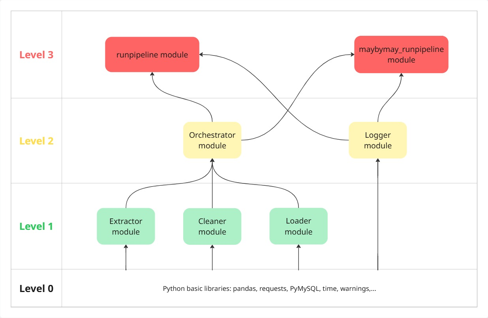

# Pipeline Service

## 1. Role

The **Pipeline Service** is responsible for creating, operating, and orchestrating the data pipelines of the Data Warehouse system.

It provides a modular framework for extracting, cleaning, transforming, and loading data from different sources according to different business rules.

The service is organized into multiple modules, with each module containing specialized classes and functions responsible for a specific task.

---

## 2. Architecture

The Pipeline Service follows a **three-level modular architecture**. Each module is designed to handle a specific responsibility, which helps keep the pipelines organized and makes individual components easier to maintain and reuse.

The architecture can be illustrated as follows:

### Level 1 — Data Processing Components

Level 1 consists of three modules:

- **Extractor**
- **Cleaner**
- **Loader**

These modules contain specialized classes for extracting, cleaning/transforming, and loading data from different sources and according to different business rules.

Each class focuses on a specific type of data-processing task. These classes are then used by higher-level modules to construct complete data pipelines.

### Level 2 — Pipeline Definition & Logging

Level 2 consists of two modules:

- **Orchestrator**
- **Logger**

#### Orchestrator

The `orchestrator` module uses classes provided by the Level 1 modules to define individual pipelines.

Each function defined in the orchestrator represents **one complete data pipeline**, combining the appropriate extraction, cleaning, and loading components required for a specific data-processing workflow.

This layer therefore acts as the connection between individual data-processing components and complete pipelines.

#### Logger

The `logger` module is responsible for recording pipeline execution logs.

The generated log information is stored in a database table, allowing pipeline execution activities to be recorded and monitored.

### Level 3 — Pipeline Execution & Control

Level 3 contains modules that serve a role similar to a `main.py` file.

These modules act as the **working entry points** for executing the pipeline service.

They determine which pipelines should be executed and provide the starting point from which the selected pipelines are run.

---

## 3. Understand the Architecture through an Analogy

The architecture can be easier to understand by imagining the entire data pipeline system as a **production line in a factory**.

### Level 1 — Individual Machines

The modules in Level 1 can be thought of as individual processing machines.

Each machine is designed to perform a specific task, such as extracting raw materials, processing them, or loading the finished product.

These machines can be placed at different positions in a production line depending on what the production process requires.

Similarly, the classes in the `extractor`, `cleaner`, and `loader` modules perform specialized data-processing tasks and can be combined in different ways.

### Level 2 — Production Lines

The functions in Level 2 can be thought of as **complete production lines**.

Each production line selects and connects the appropriate machines from Level 1 to create a specific production process.

Similarly, each function in the `orchestrator` module selects the appropriate extraction, cleaning, and loading components to form a complete data pipeline.

The `logger` module works alongside these pipelines to record information about their execution.

### Level 3 — Control Panel

Level 3 can be thought of as the **control panel of the factory**.

The control panel does not perform the individual manufacturing operations itself. Instead, it controls which production lines should be started and which should remain inactive.

Similarly, the Level 3 modules act as the entry points of the Pipeline Service. They determine which pipelines should be executed and start the selected pipelines.

In general, this separation allows individual processing components to be reused across different pipelines while keeping pipeline definitions and execution control at higher layers.